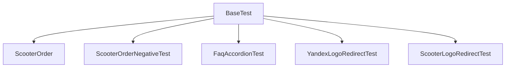

#  UI-автотесты для сервиса «Яндекс Самокат»


Автоматизированные UI-тесты веб-приложения **Яндекс Самокат**, реализованные в рамках учебного проекта.  
Проект построен на базе Selenium WebDriver + JUnit с использованием паттерна Page Object Model.

---

#  Содержание

- [Технологии](#технологии)
- [Структура проекта](#структура-проекта)
- [Запуск тестов](#запуск-тестов)
- [Реализованные тесты](#реализованные-тесты)
- [Архитектура](#архитектура)
- [PageObject-структура](#pageobject-структура)
- [Константы](#константы)
- [Автор](#автор)

---

#  Технологии

| Технология | Версия |
|-----------|--------|
| **Java** | 11 |
| **Maven** | 3.9.0 |
| **JUnit** | 4.13.2 |
| **Selenium WebDriver** | 4.13 |
| **WebDriverManager** | 5.x |
| **IntelliJ IDEA** | 2023+ |
| **Mermaid diagrams** | ✔ поддерживается |

---

#  Структура проекта

```
src
 ├── main
 │    └── java
 │          ├── constants
 │          │      ├── Urls.java                 # базовый URL сервиса
 │          │      └── ValidationMessages.java   # константы сообщений
 │          └── pageobject
 │                 ├── HomePageScooter.java
 │                 ├── ScooterOrderPage.java
 │                 ├── OrderDetailsPage.java
 │                 ├── OrderStatusPage.java
 │                 └── YandexHomepage.java
 │
 └── test
      └── java
           └── tests
                 ├── BaseTest.java
                 ├── FaqAccordionTest.java
                 ├── ScooterLogoRedirectTest.java
                 ├── ScooterOrder.java
                 ├── ScooterOrderNegativeTest.java
                 ├── WrongNumberStatus.java
                 └── YandexLogoRedirect.java
```

---

# ▶ Запуск тестов

## 1. Запустить все тесты

```bash
mvn clean test
```

## 2. Запустить конкретный тест

```bash
mvn -Dtest=ScooterOrder test
mvn -Dtest=FaqAccordionTest test
mvn -Dtest=ScooterOrderNegativeTest test
mvn -Dtest=YandexLogoRedirectTest test
mvn -Dtest=WrongNumberStatus test
mvn -Dtest=ScooterLogoRedirectTest test
```

---

# Реализованные тесты

| Тест                         | Описание                                                                                                |
|------------------------------|---------------------------------------------------------------------------------------------------------|
| **ScooterOrderTest**         | Проверка успешного оформления заказа (2 пути) В GoogleChrome не работает кнопка подтверждения заказа Да |
| **ScooterOrderNegativeTest** | Негативные сценарии создания заказа                                                                     |
| **FaqAccordionTest**         | Проверка выпадающих вопросов (FAQ)                                                                      |
| **YandexLogoRedirectTest**   | Переход на Яндекс в новой вкладке                                                                       |
| **WrongNumberStatusTest**    | Проверка статуса заказа по неверному номеру                                                             |
| **ScooterLogoRedirectTest**  | Проверка редиректа по логотипу                                                                          |

---

# Архитектура



---

# PageObject-структура

Каждая страница вынесена в отдельный класс:

- `HomePageScooter` — главная страница (кнопки заказа, FAQ, логотипы)
- `ScooterOrderPage` — форма ввода данных клиента
- `OrderDetailsPage` — форма аренды и подтверждения
- `OrderStatusPage` — проверка статуса заказа
- `YandexHomepage` — ожидаемая страница редиректа

Пример метода:

```java
public void clickFirstOrderButton() {
    driver.findElement(firstOrderButton).click();
}
```

---

# Константы

```java
public static final String BASE_URL = "https://qa-scooter.praktikum-services.ru/";
```

Хранятся в:

```
constants/ValidationMessages.java
constants/Urls.java
```

---

# Автор

**Анна Корольчук**  
QA Engineer (Manual + Automation in progress)  
GitHub: https://github.com/Chuckini


